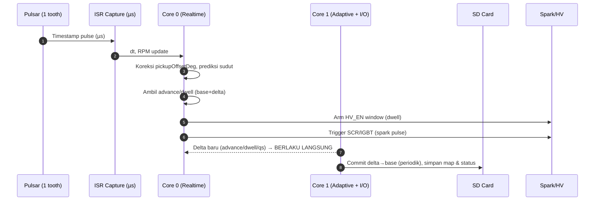

# Smart CDI Racing Adaptive — Dokumentasi Lengkap (Markdown)

> **Ringkas:** CDI 2-tak berbasis **ESP32** untuk **racing use** dengan **multi-profil**, **adaptif penuh**, **real-time apply (tanpa restart)**, dukungan **pulsar 1 tonjolan** sebagai pickup, serta integrasi **GPS, IMU, sensor lingkungan, EGT/CHT, HV, QS**. **Semua input sensor mempengaruhi logic adaptif** (advance, dwell, QS cut, limiter/LC). Dilengkapi **Knock proxy via accelerometer band-pass**, **Web/Serial UI** (live monitor & ganti profil), dan **analisa GPS drag/lap (auto start–finish)**.

---

## 1) Tujuan & Nilai Utama

- **Performa maksimal otomatis**: sistem belajar **on-the-fly** dari data sensor.
- **Multi-profil track**: _harian, 200, 400, 500, 1000 m_ — **tiap profil punya logic & map sendiri** (isolasi total).
- **Real-time apply**: koreksi/map baru **langsung terasa** tanpa restart modul.
- **Pickup fleksibel (pulsar 1 tonjolan)**: kompensasi `pickupOffsetDeg` per profil.
- **UI Web/Serial**: live monitor, ganti profil, baca status optimality & rekomendasi **shift RPM**.
- **Knock proxy (IMU band-pass)**: retard & dwell guard otomatis saat indikasi knock.
- **GPS analyzer**: mode **drag** (auto 200/400/500/1000 m) & **lap** (geofence start/finish).

---

## 2) Hardware & Sensor

### 2.1 MCU & IO

- **ESP32 dual-core**

  - **Core 0**: real-time engine (ISR pickup, scheduler spark/dwell).
  - **Core 1**: adaptive logic, sensor non-crank, logging, Web/Serial, SD.

- **Timer**: hw_timer atau MCPWM/LEDC (jitter sub-µs).
- **Storage**: SD card (SPI).

### 2.2 Sensor/Actuator (contoh & peran)

| Komponen                                      | Peran                    | Kenapa penting untuk adaptif                                                                                  |
| --------------------------------------------- | ------------------------ | ------------------------------------------------------------------------------------------------------------- |
| **Pulsar 1 tonjolan (Hall/VR + kondisioner)** | Posisi referensi & RPM   | Basis semua timing; single-tooth ⇒ butuh **pickupOffsetDeg** & **predictive scheduling** untuk akurasi sudut. |
| **EGT, CHT**                                  | Guard termal & efisiensi | Penalti saat panas → retard/dwell naik.                                                                       |
| **IMU (accel/gyro)**                          | Akselerasi, pitch/roll   | **Perf metric**, **knock proxy** via band-pass.                                                               |
| **Load-cell QS (HX711)**                      | Deteksi shifting         | QS cut adaptif per RPM.                                                                                       |
| **Kopling switch**                            | Launch Control           | LC aktif saat kopling tarik.                                                                                  |
| **HV voltage (ADC)**                          | Monitor charge cap       | Dwell adaptif menjaga energi spark.                                                                           |
| **GPS**                                       | Kecepatan, jarak, waktu  | Perf metric, drag time (200/400/500/1000), lap time.                                                          |
| **Sensor lingkungan** (T, baro, RH)           | Koreksi densitas         | Koreksi advance/dwell sesuai kondisi sekitar.                                                                 |
| **SCR/IGBT driver + HV_EN**                   | Spark & window charge    | Output deterministik (5–20 µs), HV window (ms).                                                               |

> **Resolusi waktu @ 20.000 rpm**: 1 rev = 3 ms; 1° crank ≈ 8,33 µs. Target jitter spark **< 1 µs**.

---

## 3) Pickup: Pulsar 1 Tonjolan

- **Deteksi**: satu pulse per rev → hitung RPM dari delta waktu antar pulse.
- **Sudut absolut**: ditetapkan via **`pickupOffsetDeg`** di `cfg.json` per profil (jarak sudut dari pulse ke **TDC referensi**/target).
- **Predictive scheduling**: karena hanya 1 pulse/rev, sudut spark berikut diprediksi dari **RPM tersaring (Kalman/EMA)** + **offset** + advance map. Ini menjaga akurasi saat fluktuasi kecil RPM.
- **Ring buffer** 5–10 periode terakhir → RPM stabil (anti jitter pickup).

---

## 4) Arsitektur Perangkat Lunak

### 4.1 Flow Real-Time (ringkas)



### 4.2 Loop Adaptif (tiap profil)

```
Data map dasar → Koreksi (±Δ) → Update delta (langsung dipakai) →
Commit periodik (base += k·delta; delta *= keep) → Simpan ke SD → Ulangi
```

- **Advance**: bandit ±Δ° per RPM bin + koreksi fuzzy limiter.
- **Dwell**: EMA guard (HV sag/termal).
- **QS**: bandit ms cut per RPM (minim cut tanpa miss-shift).
- **Knock proxy** (IMU band-pass): retard kecil + dwell naik tipis saat score tinggi.
- **Semua sensor mempengaruhi** koreksi—lihat §6 (fungsi objektif).

---

## 5) Struktur Berkas Proyek (Firmware)

> **Tujuan**: modular, mudah dikembangkan.

```
  config.h                # pinout, konstanta global (RPM_BINS, band limiter, dll)
  types.h                 # struct Sample/SparkCmd/Telemetry
  trigger_capture.*       # ISR/pembacaan pulsar 1-tooth
  ignition_scheduler.*    # timer spark (pulse SCR/IGBT)
  hv_control.*            # window charge HV_EN (ms, sebelum spark)
  map1d.*                 # map 1D (RPM) base+delta (advance)
  pack.*                  # MapPack: advance, dwell, qs + algo choice
  adaptive1d.*            # learner 1D sederhana
  adaptive_engine.*       # engine adaptif gabungan (advance/dwell/qs)
  limiter.*               # 5 mode limiter (LC & top RPM)
  profiles.*              # manajemen profil aktif
  storage_sd.*            # inisialisasi /cdi + log run.csv (umum)
  storage_pack.*          # I/O advance.csv, dwell.csv, qs.csv, algo.json, cfg.json
  profile_config.*        # baca/tulis cfg.json per profil
  opt_tracker.*           # best/avg perf → optimality% per RPM
  status_dump.*           # tulis status.csv (optimality)
  knock_proxy.*           # band-pass IMU → knock score/hit
  gps_analyzer.*          # drag/lap auto start–finish
  web_ui.*                # UI http: live monitor & switch profil
  smartCDI.ino                # integrasi Core0/Core1, loop utama
```

**Fungsi ringkas tiap file**:

- `trigger_capture.*` — timestamp pulse pulsar → RPM + penanda event.
- `ignition_scheduler.*` — arm alarm µs → pulse gate SCR/IGBT 5–20 µs.
- `hv_control.*` — kalkulasi jendela charge: `sparkDueUs - dwellMs … sparkDueUs-50µs`.
- `map1d.*` — base/ delta, `get()`, `smooth()`, `commitDelta()`.
- `pack.*` — mengemas `advance/dwell/qs` + `algo` menjadi set profil.
- `adaptive_engine.*` — mengolah Telemetry (RPM, IMU, EGT/CHT, HV, GPS, lingkungan, QS/CLUTCH) untuk memutuskan **advance/dwell/QS** dan memperbarui delta.
- `limiter.*` — SoftRetard / DitherSkip / WindowCut / PhaseSpread / HybridSmart.
- `storage_sd.*` — membuat `/cdi/{config,log,map}`, log run, util.
- `storage_pack.*` — load/save map & algo/cfg per profil (atomic replace).
- `profile_config.*` — mode limiter LC/top, `pickupOffsetDeg`, `shiftRpmRecommended`.
- `opt_tracker.*` — best/avg perf per RPM, optimality%.
- `status_dump.*` — tulis `status.csv` untuk visualisasi.
- `knock_proxy.*` — desain Biquad BP 300–800 Hz (default) + RMS window + EMA baseline → `score` & `hit`.
- `gps_analyzer.*` — **Drag**: auto start (speed↑ & kopling lepas/IMU accel) + `t200/400/500/1000`. **Lap**: geofence start/finish.
- `web_ui.*` — HTTP index (Bootstrap/Chart.js), API `/api/status`, `/api/profiles`, `/api/select`, `/api/optimality`.

---

## 6) Struktur Berkas SD & Fungsi

```
/cdi/
  config/                      # (opsional) pengaturan umum
  log/
    run.csv                    # ms,rpm,egt,cht,profile,limiter,knockScore,gpsSpeed,dist
  map/
    <profil>/                  # harian / 200 / 400 / 500 / 1000
      advance.csv              # base_deg,delta_deg (RPM_BINS baris, tanpa header)
      dwell.csv                # base_ms,delta_ms
      qs.csv                   # base_ms,delta_ms
      algo.json                # {"advance":"kalman_ema_fuzzy","dwell":"ema_guard","qs":"bandit_ema"}
      cfg.json                 # lihat di bawah
      status.csv               # rpm_bin,rpm,perf_best,perf_avg,optimal_pct
```

**`cfg.json` (per profil, contoh lengkap)**:

```json
{
  "pickupOffsetDeg": 72.5,
  "lcMode": "SoftRetard",
  "lcHoldRpm": 7000,
  "rpmMode": "HybridSmart",
  "rpmSetpoint": 13000,
  "shiftRpmRecommended": 9200,

  "knock": { "fs": 1000, "fLow": 300, "fHigh": 800, "winMs": 25, "sens": 1.5 },
  "gps": { "mode": "drag", "gateLat": -6.2, "gateLon": 106.8, "gateR": 8.0 },
  "qs": { "minRpm": 4000, "baseCutMs": 65, "refractMs": 250, "forceN": 25 }
}
```

**Fungsi tiap file:**

- `advance.csv` — peta sudut dasar + delta adaptif (°BTDC).
- `dwell.csv` — peta lama charge HV (ms) dasar + delta adaptif.
- `qs.csv` — peta durasi **QS cut** per RPM (ms) dasar + delta adaptif.
- `algo.json` — pilihan logic adaptif per subsistem (per profil).
- `cfg.json` — pengaturan **LC/top limiter**, **pickupOffsetDeg**, **ShiftRPM**, serta parameter **knock/GPS/QS**.
- `status.csv` — laporan **optimality%** per RPM (best/avg perf) — untuk evaluasi progres adaptasi.
- `run.csv` — log singkat operasi (untuk review pasca run / debug ringan).

> **Inisialisasi awal**: jika folder/file belum ada, modul otomatis membuat **default** yang aman.

---

## 7) Fungsi Objektif & Integrasi Semua Sensor

**Perf metric (intuitif):**

```
Perf = w1·(dRPM/dt_filtered) + w2·GPS_speed + w3·(Δdist/Δt)
Penalty = kEGT·overheat + kCHT·overheat + kHV·sag + kKnock·score
Score = Perf - Penalty
```

- **Advance adaptif**: bandit ±Δ° → jika **Score naik** → lanjutkan arah; jika turun → balik arah (clamped & smoothed).
- **Dwell adaptif**: +ms saat HV sag / aksel tinggi / panas; −ms saat stabil (efisiensi).
- **QS adaptif**: jika shifting mulus → **turunkan** ms; jika kasar/miss → **naikkan** ms (per RPM).
- **Knock proxy**: saat `score≥sens` → **retard kecil** & **dwell +** tipis.
- **Lingkungan** (T/baro/RH) → koreksi densitas udara (opsi bobot kecil) ⇒ pengaruh ke advance/dwell.

> **Semua sensor** ikut membentuk `Score` → **semua mempengaruhi** hasil adaptasi.

---

## 8) Limiter & Launch Control (per profil)

- **LC** aktif saat kopling tarik:

  - Mode & setpoint dari `cfg.json` (`lcMode`, `lcHoldRpm`).
  - Saran mode LC: `SoftRetard` / `PhaseSpread` untuk feel halus saat start.

- **Limiter puncak (top RPM)**:

  - Mode & setpoint dari `cfg.json` (`rpmMode`, `rpmSetpoint`).
  - Saran mode top: `HybridSmart` (retard + dither micro-cut).

- **Tujuan**: RPM **nempel** tanpa “mbrebet” atau hilang torsi mendadak.

---

## 9) Knock Proxy via Accelerometer Band-Pass

- **Filter**: Biquad band-pass (default 300–800 Hz\@1 kHz) + **RMS window** (\~25 ms) + **EMA baseline**.
- **Skor**: `score = RMS / baseline`. **Hit** jika `score ≥ sens` (default 1.5).
- **Aksi** (halus, per RPM bin aktif):

  - Advance delta **−0.2° … −1.0°** (sesuai keparahan).
  - Dwell delta **+0.02 … +0.05 ms**.

- **Tuning**: `fLow/fHigh/winMs/sens` di `cfg.json`.

---

## 10) GPS Analyzer (Drag & Lap)

- **Drag**:

  - **Start** otomatis saat speed naik dari idle **&** kopling lepas atau IMU accel > ambang.
  - **Finish** pada jarak target: **200/400/500/1000 m** (rekam waktu masing-masing).

- **Lap**:

  - **Start/Finish geofence**: (lat,lon,radius) → lap complete saat masuk kembali ke lingkaran.

- **Output**: `t200/t400/t500/t1000`, `tLap`, `Vmax`, jarak, dsb (ke `run.csv` & UI).

---

## 11) UI Web & Serial

### 11.1 Web (HTTP)

- **`GET /`**: halaman live (Bootstrap + Chart.js).
- **`GET /api/status`**: JSON status (rpm, adv, dwell, profile, shiftRec, gps, optimality bin).
- **`GET /api/profiles`**: `{list:[...], active:"..."}`.
- **`POST /api/select?name=<profil>`**: ganti profil (apply langsung).
- **`GET /api/optimality`**: muat `status.csv` profil aktif.

> **Polling 500 ms**; hindari banyak klien saat race.

### 11.2 Serial (CLI)

- `status` → ringkasan.
- `profiles` → daftar & aktif.
- `select <name>` → ganti profil.
- `limiter lc <mode> <rpm>` / `limiter top <mode> <rpm>` → atur & simpan `cfg.json`.

---

## 12) Optimality % & Shift RPM

- **Optimality % per RPM** = `100 × avgPerf / bestPerf` (clamp 0–100).
- **status.csv** menyimpan kurva; UI bisa render grafik.
- **Shift RPM rekomendasi**:

  - Cari puncak **avgPerf** pada **≥70%** redline; +buffer \~200 rpm.
  - Disimpan ke `cfg.json` → tampil di UI/Serial.

---

## 13) Kinerja, Jitter, & Komit

- ISR target < **3 µs**; tidak ada `Serial.print`/float berat di ISR.
- Spark jitter target < **1 µs** (≈0.12° @ 20k).
- **Commit periodik** (3–10 s): `base += k·delta` (mis. `k=1.0`), `delta *= keep` (mis. `keep=0.2–0.3`).
- **Save** ke SD **atomic** (`.tmp` → rename).
- **Wi-Fi/BLE OFF** saat mesin jalan (opsional) untuk jitter minimal.

---

## 14) Kalibrasi & Tuning

1. **Pickup**: set `pickupOffsetDeg` (osiloskop bantu melihat posisi TDC vs pulse).
2. **QS**: tare & scale load-cell; set `forceN`, `baseCutMs`, `refractMs`.
3. **Dwell**: mulai 1.2–1.5 ms; biarkan adaptif menyesuaikan.
4. **Knock**: sesuaikan `sens` & band-pass jika terlalu sensitif.
5. **Limiter**: LC → `SoftRetard/PhaseSpread`; top → `HybridSmart`.
6. **Eval**: cek **`status.csv`**; fokus RPM bin dengan optimality% rendah.

---

## 15) Safety & Fail-Safe

- **HV 250–400 V**: berbahaya — uji dengan dummy load sebelum mesin.
- SD error → pakai map default di flash (ignition tetap jalan).
- Sensor kritis error → adaptif off sementara; spark tetap stabil.
- **EMI**: ground bintang, jejak HV pendek, snubber R-C, isolasi gate.

---

## 16) Parameter & Satuan (ringkas)

| Item            | Satuan | Catatan                       |
| --------------- | ------ | ----------------------------- |
| Advance         | °BTDC  | di-clamp `[ADV_MIN, ADV_MAX]` |
| Dwell           | ms     | window HV_EN sebelum spark    |
| QS cut          | ms     | inhibit spark (non-blocking)  |
| pickupOffsetDeg | °      | sudut dari pulse ke referensi |
| Knock score     | –      | RMS/baseline; hit jika ≥ sens |
| GPS speed       | m/s    | jarak via haversine           |
| Optimality      | %      | 0–100; dari best/avg perf     |

---

## 17) Contoh Isi Berkas

**`advance.csv`** (tanpa header, 1 baris per RPM bin)

```
10.0000,0.0000
10.4167,0.1000
...
```

**`dwell.csv`**

```
1.2000,0.0000
1.2200,0.0100
...
```

**`qs.csv`**

```
65.0000,0.0000
64.0000,-1.0000
...
```

**`algo.json`**

```json
{ "advance": "kalman_ema_fuzzy", "dwell": "ema_guard", "qs": "bandit_ema" }
```

**`cfg.json`** (lihat §6)

**`status.csv`**

```
rpm_bin,rpm,perf_best,perf_avg,optimal_pct
0,600,12.3,10.1,82.1
...
```

**`log/run.csv`**

```
ms,rpm,egt,cht,profile,limiter,knockScore,gpsSpeed,dist
1234,8750,520,125,200,HybridSmart,1.18,21.6,38.2
```

---

## 18) Roadmap Opsional

- Per-gear map (jika ada sensor gear).
- Deteksi kualitas shift (post-shift RPM window ±150 ms).
- Viewer `status.csv` di Web (grafik optimality% vs RPM).
- Parser JSON lengkap (ArduinoJson) + validasi skema.
- Auto-density correction dari sensor lingkungan (opsional enable/disable per profil).

---

### Penutup

Dokumen ini merangkum **fitur & cara kerja** Smart CDI Racing Adaptive secara lengkap. Dengan **pulsar 1 tonjolan** (pickupOffset + prediksi), integrasi **GPS/IMU/lingkungan/EGT/CHT/HV/QS**, **Knock proxy band-pass**, dan **UI Web/Serial**, sistem ini:

- **menerapkan perubahan map seketika**,
- **belajar mandiri per profil**,
- dan **menjaga torsi halus** (limiter cerdas) hingga **20.000 rpm**.

Semua **input sensor** ikut membentuk keputusan adaptif, sehingga CDI selalu bergerak menuju **performa puncak** untuk trek & motor yang kamu pakai.
